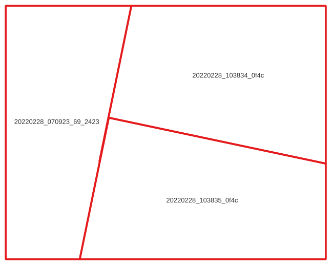

# Planet Coverage Finder

Planet Coverage Finder helps find complete coverages of a user's area using PlanetScope scenes.

# Installation

You can install the package and its dependencies using `pip`:

```
$ pip install .
```

This will install the command-line executable `pcf`.

# Usage

The tool will take an input area (or areas) plus time range and attempt to find a single day in which PlanetScope imagery covers the area completely.

```
$ pcf map.geojson 2022-01-01 2022-02-28
1: checking 2022-02-28 for coverage
1: checking 2022-02-27 for coverage
2: checking 2022-02-28 for coverage
1: SUCCESS (date: 2022-02-27 scenes: 1)
2: SUCCESS (date: 2022-02-28 scenes: 3)
```

The output shows that there were two features in the input file `map.geojson` and that the tool was able to find a complete coverage for the first feature on 2022-02-27 and a coverage for the second feature on 2022-02-28.

If the features in `map.geojson` have an attribute that can use used to better identify them, then it can be specified with the `--attribute` parameter:

```
$ pcf map.geojson 2022-01-01 2022-02-28 --attribute name
Munich: checking 2022-02-28 for coverage
Munich: checking 2022-02-27 for coverage
Berlin: checking 2022-02-28 for coverage
Munich: SUCCESS (date: 2022-02-27 scenes: 1)
Berlin: SUCCESS (date: 2022-02-28 scenes: 3)
```

## Results

To see detailed information on which scenes and their exact areas were used to create this coverage, the following parameters can be used:

```
  -o, --output TEXT               Name to use for all output files.
  -u, --geojson-unusable          Save a GeoJSON with the AOIs for which there were not any usable results.
  -Q, --qgis                      QGIS project file for results.
  -x, --xyz                       Create an XYZ tile service URL.
  -w, --wmts                      Create a WMTS tile service URL.
```

If `-o` is provided, all output files will use this prefix; if it isn't provided, the output filenames will be based on the input file.

The output GeoJSON file for successful searches will show the required scenes *and* the exact part of each scene to provide the 100% coverage:



## Finding the right images

The default search assumes that the user needs 100% coverage on a single day and doesn't care about clouds. Planet Coverage Finder can help restrict the resutls to match specific requirements:

```
  -c, --max-clouds INTEGER RANGE  Maximum cloud cover percentage.  [0<=x<=100]
  -C, --confidence INTEGER RANGE  Required confidence when using UDM-based cloudiness checks.  [0<=x<=100]
  -m, --mask-types [cloud|shadow|lighthaze|heavyhaze|snow]
  				  UDM2 types to consider when evaluating cloudiness of images.
  -f, --frame INTEGER RANGE       Time frame in days to search for acceptable data (all images will be captured within this many days of one another).  [x>=1]
  -q, --image-quality [all|standard|preferential]
                                  How to handle images of different quality.
  -s, --satellite TEXT            Satellite generation: PS0, PS1, PS2, PS2.SD, PSB.SD.
  -t, --min-cover INTEGER RANGE   Required coverage percentage.  [1<=x<=100]
```

If one or more `-m` parameters are used, then `pcf` will use the UDM file to calcualte the exact cloudiness and confidence score; if no `-m` parameters are provided, it will estimate cloudiness based on the scene-level metadata, with a confidence of 0.

By default, images of all qualities will be considered, but images that were automatically assessed to be `test` quality will only be added to the coverage if there are no images of `standard` quality available. By setting `--image-quality` to `standard`, `test` images will be excluded, and by using `all`, the tool will not distinguish between different image qualities.

Using the `--frame` parameter will perform a search over a rolling window of multiple days instead of requiring data to be from a single day only.

## Ordering the images

Planet Coverage Finder can also create and download an order for each feature.

```
  --order / --no-order            Submit an order for scenes.
  -b, --bundle TEXT               Bundles to download.
  -d, --download                  Download orders.
  -e, --email                     Send email for each order.
  -r, --reproject INTEGER         Reproject to a specific SRS (or no reprojection if set to 0).
```

**WARNING: The tool will only clip the images to the original search area. In the example image above, three images would be ordered, each clipped to the same large rectangle.**

## Example

The following command, will find imagery for each feature in `aoi.geojson` in September 2019. The features must be at least 90% covered by imagery and the imagery must be at most 10% cloudy (defined as heavy haze or clouds). A GeoJSON file will contain the geometries of PlanetScope imagery used to successfully provide a coverage over each feature, and a QGIS project will be created to view the results. Finally, it will download each of the images used to create the coverage, clipped to the original feature.

`pcf aoi.geojson 2019-09-01 2019-09-30 -c 10 -t 90 -m heavyhaze -m cloud --qgis -d`
